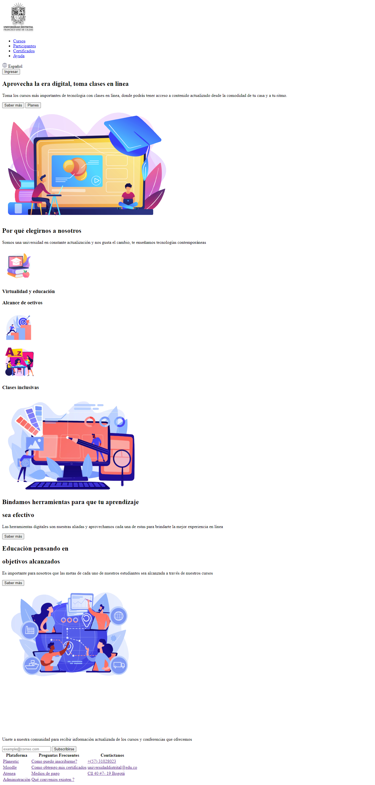
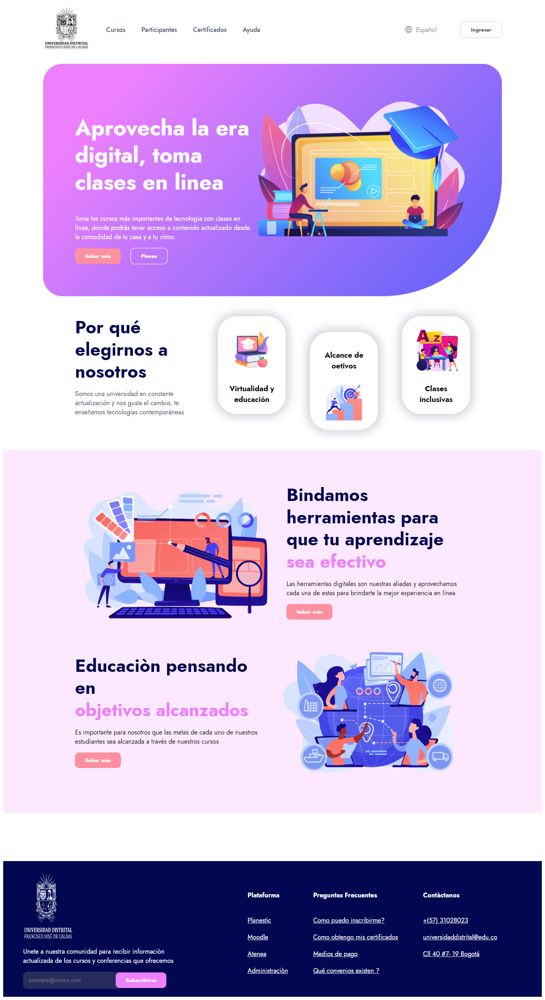

<h1>Taller 9 - Loren Vega</h1>

<h2>Información</h2>

Curso: Full Stack Basico - Grupo 1 

Profesor: Cristian Patiño

<h2>Link de la pagina web</h2>

<h2>Punto 1: Link de figma</h2>
<a href="https://www.figma.com/file/hZN6GGCgqPm35GWRlITsYq/Loren-Vega-Mejia?type=design&node-id=5%3A511&mode=design&t=pCOEwhWJlNGad6aI-1">Link de figma</a>

<h2>Punto 2: Diseño en HTML</h2>

<h2>Punto 3: Diseño con CSS</h2>

<h2>Punto 4: Títulos</h2>

<h2>Punto 5: Párrafo</h2>

<h2>Punto 6: Links</h2>
 

<h2>Punto 7 y 8 : Navegación</h2>

<h2>Punto 9:  Tabla</h2>
